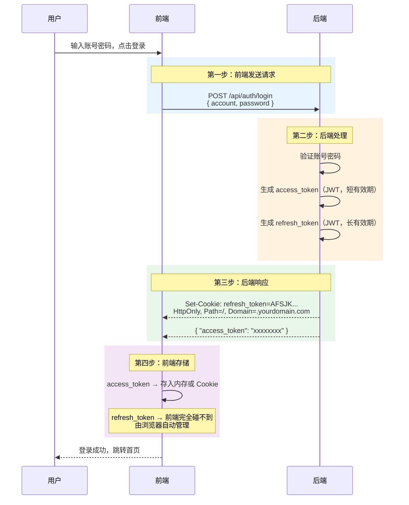

# 登录流程详细图

```mermaid
sequenceDiagram
    participant U as 用户
    participant F as 前端
    participant B as 后端

    U->>F: 输入账号密码，点击登录

    rect rgb(230, 245, 255)
        Note over F,B: 第一步：前端发送请求
        F->>B: POST /api/auth/login<br/>{ account, password }
    end

    rect rgb(255, 243, 224)
        Note over B: 第二步：后端处理
        B->>B: 验证账号密码
        B->>B: 生成 access_token（JWT，短有效期）
        B->>B: 生成 refresh_token（JWT，长有效期）
    end

    rect rgb(232, 245, 233)
        Note over B,F: 第三步：后端响应
        B-->>F: Set-Cookie: refresh_token=AFSJK...<br/>HttpOnly, Path=/, Domain=.yourdomain.com
        B-->>F: { "access_token": "xxxxxxxx" }
    end

    rect rgb(243, 229, 245)
        Note over F: 第四步：前端存储
        F->>F: access_token → 存入内存或 Cookie
        Note over F: refresh_token → 前端完全碰不到<br/>由浏览器自动管理
    end

    F-->>U: 登录成功，跳转首页
```
